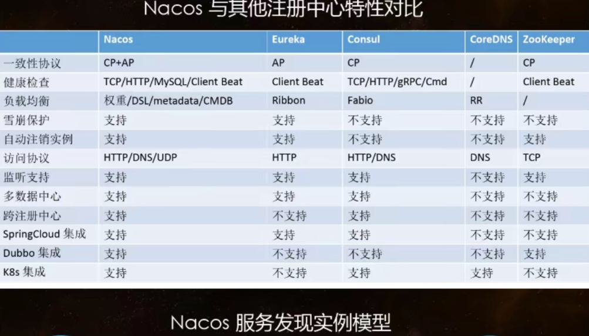

# springclouddemo
``业余时间根据B站学习的，后面会整理一下（B站上讲的有很大一部分版本比较旧了，学习的时候需要结合自己当时的环境适当改进）``

hystrix 在SpringCloud 2020.0.3亦或许之前版本里，被废弃了部分注解，并且阿里巴巴的sentinal更优秀，因此hystrix的demo完成了一小部分而已

stream 在3.0后变化也不小，EnableBinding Output Input注解已经被废弃，已经按照约定大于配置的方式去实现了，确实简化了不少。

SpringCloud集成zipkin
        <dependency>
            <groupId>org.springframework.cloud</groupId>
            <artifactId>spring-cloud-starter-sleuth</artifactId>
        </dependency>
        <dependency>
            <groupId>org.springframework.cloud</groupId>
            <artifactId>spring-cloud-sleuth-zipkin</artifactId>
        </dependency>

Sleuth 默认采用 Http 方式将 span 传输给 Zipkin
zipkin术语：
    Span：基本的工作单元。Span包括一个64位的唯一ID，一个64位trace码，描述信息，时间戳事件，key-value 注解(tags)，span处理者的ID（通常为IP）。
    Trace：一组Span形成的树形结构。
    Annotation：用于及时记录存在的事件。常用的Annotation如下：

        cs：客户端发送(client send) 客户端发起一个请求，表示span开始
        sr：服务器接收(server received) 服务器接收到客户端的请求并开始处理，sr - cs 的时间为网络延迟
        ss：服务器发送(server send) 服务器处理完请求准备返回数据给客户端。ss - sr 的时间表示服务器端处理请求花费的时间
        cr：客户端接收(client received) 客户端接收到处理结果，表示span结束。 cr - cs 的时间表示客户端接收服务端数据的时间

过段时间看看能否集成es，将日志打到es中

2021年09月05日已经成功集成es

nacos支持AP和CP模式的切换(默认AP原则)

`curl -X PUT '$NACOS_SERVER:8848/nacos/v1/ns/operator/switches?entry=serverMode&value=CP'`

同时微服务的bootstrap.properties 需配置如下选项指明注册为临时/永久实例
AP模式不支持数据一致性，所以只支持服务注册的临时实例，CP模式支持服务注册的永久实例，满足配置文件的一致性

`#false为永久实例，true表示临时实例开启，注册为临时实例`

`spring.cloud.nacos.discovery.ephemeral=false`

配置nacos 的config遇到的坑真多

1.首先cloud 2020之后的版本，需要引入bootstrap的依赖才能使用bootstrap.yml

       <dependency>
            <groupId>org.springframework.cloud</groupId>
            <artifactId>spring-cloud-starter-bootstrap</artifactId>
        </dependency>

2.正常启动后又遇到[NACOS Exception httpPost] currentServerAddr: http://123.56.25.210:8848

    按照github issue的解决方法 就是把clashX关掉即可，一般不翻墙的可能还遇不到，卧槽

-----------------------------------------------------
cloud-seata-order/storage/account 三个微服务是为了完成seata测试，三个微服务对应三个数据库

seata版本：1.4.2 
nacos版本：2.0.2
mysql版本：8.0.21

我用的springcloud版本已经移除了hystrix和ribbon，需要引入sentinel和loadbalancer
对于断路器Circuit Breaker，目前能选择的只有sentinel和resilience4j(这个还未实践测试)，hystrix停更，retry应该不是面向微服务的

配置相对于以前的版本，简化了一些，不过它的配置和原理本身就很繁琐。我只完成了配置和测试，至于原理，后面整理